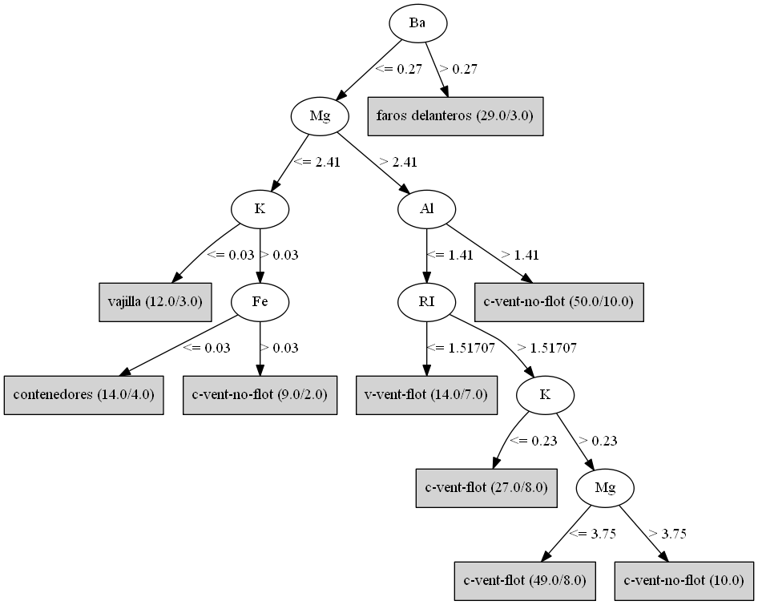
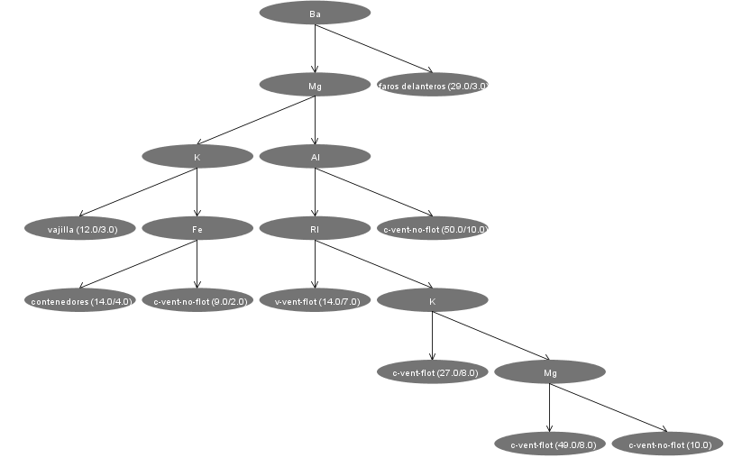

layout: true

<div class="my-header"></div>

<div class="my-footer"></div><span>
.footnote[ `r anicon::faa("twitter",animate="wrench",colour="skyblue", anitype="parent-hover")` .white[@Nahuel_Sef] .white[-------Sígueme-------]  `r anicon::faa("github",animate="wrench",colour="skyblue", anitype="parent-hover")` .white[@NahuelBargas]]
</span>
---


```{r, load_refs, include=FALSE, cache=FALSE} 
options(htmltools.dir.version = FALSE)
library(RefManageR) 
library(highcharter)
library(tidyverse)
library(knitr)
library(RWeka)
library(partykit)
library(stargazer)

knitr::opts_chunk$set(message = FALSE, warning = FALSE, comment="",width=50, class.output = "azul")

myBib <- ReadBib("archivos/book2.bib", check = FALSE) 
BibOptions(check.entries = FALSE, 
           bib.style = "authoryear", 
           cite.style = "authoryear", 
           style = "markdown", 
           hyperlink = "to.doc", 
           dashed = FALSE) 
```

```{css, echo=FALSE}
.azul {
  background-color: skyblue;
  border: 1px solid blue;
  font-weight: bold;
}
```

# Crossover


- .large[.green[Weka]] y .large[.blue[R]] nacieron en el mismo país, Nueva Zelanda.

-  .large[.blue[R]](`r Citet(myBib, "R-base")`) es un sistema para realizar análisis estadísticos,econométricos,
 minería de datos y gráficos de gran calidad, entre otras posibilidades. Gracias a la adición de paquetes con características 
 adicionales, su espectro de alcance tiene varias ramificaciones. Es de código abierto y cuenta con una gran cantidad de autores 
 a lo largo del mundo que contribuyern a su mantenimiento y actualización . 


```{r, mapa, echo=FALSE}
nz<-jsonlite::fromJSON("archivos/nz-all.geo.json", simplifyVector = FALSE)

logos<-tibble(name=c("Weka,surgido en la Universidad de Waikato, Hamilton.","R, surgido en la Universidad de Auckland ,Auckland."),
      lat= c(-37.78333, -36.84853),
      lon= c(175.28333,174.76349))

highchart(type = "map") %>%
  hc_chart(zoomType = "xy")%>%
  hc_add_series(mapData = nz,name="Nueva Zelanda",borderColor="blue")%>%
  hc_add_series(data = logos[1,], type = "mappoint",showInLegend=FALSE,
                name = "Weka", maxSize = 2,dataLabels = list(enabled = FALSE),
                 tooltip = list(pointFormat = "{point.name}"), marker=list(symbol="url(archivos/wekalogochico.png)"))%>% 
  hc_add_series(data = logos[2,], type = "mappoint",showInLegend=FALSE,
                name = "R", maxSize = 2,dataLabels = list(enabled = FALSE),
                 tooltip = list(pointFormat = "{point.name}"), marker=list(symbol='url(archivos/Rlogochico.png)'))%>%
  hc_legend(align = "left",verticalAlign = "top",layout = "vertical",floating=TRUE,margin=0)%>%
  hc_size(650, 380)%>%
  hc_credits(enabled = FALSE)
```


---

layout:false
class: bottom hide-slide-number
background-image: url("archivos/wekasandwich.jpg")
background-size: cover

.column.slide-in-left[
.font5[.white[Conociendo a Weka]]]
.column[
]

---

layout: true

<div class="my-header"></div>

<div class="my-footer"></div><span>
.footnote[ `r anicon::faa("twitter",animate="wrench",colour="skyblue", anitype="parent-hover")` .white[@Nahuel_Sef] .white[-------Sígueme-------]  `r anicon::faa("github",animate="wrench",colour="skyblue", anitype="parent-hover")` .white[@NahuelBargas]]
</span>

---

## Características

- .bold[Weka](`r Citet(myBib, "Weka")`) está escrito en .red[Java], y permite realizar una serie de tareas relacionadas
con el aprendisaje autómatico, comprendiendo el *procesamiento de la información* ,*algoritmos de clasificación*,
*regresión*, *análisis de clústeres* y *selección de atributos*.

- Su interface gráfica es aména, y permite realizar todo el análisis sin escribir ninguna línea de código,
aunque si se quiere tener un registro de cada paso dado, se puede utilizar el API de JAVA que provee [Weka](https://www.cs.waikato.ac.nz/~ml/weka/index.html).

- Al igual que **R**, complementa sus funciones básicas con otros programas que añaden interoperabilidad  con otros softwares(
cómo el propio R, Python, Spark, Hadoop, Jython, Groovy, entre otros) y mayor cantidad de algoritmos.

- Puede instalar la versión de Weka que desee pinchando [aquí](https://www.cs.waikato.ac.nz/ml/weka)

- Luego de configurar el programa correctamente, eche un vistazo en la documentación que se encuentra en la carpeta de instalación, allí podrá observar con detalle el funcionamiento y las especificaciones de los algoritmos, filtros, etc.


---

# Su funcionamiento desde R


- Gracias al wrapper .bold[RWeka](`r Citet(myBib, "RWEKA")`) y al paquete .bold[rJava](`r Citet(myBib, "rJava")`), desde la consola de R podemos interactuar
con Weka, aplicar filtros, evaluar los modelos y graficar.


.full-width[.content-box-yellow[**Atención** Debe generarse una variable de sistema(¡En Windows!) *WEKA_HOME* que apunte a la carpeta wekafiles, el lugar en el cuál el sistema guarda la información de los paquetes instalados de WEKA.]]
 
-  Por ejemplo, para verificar los paquetes instalados en sus sistema por WEKA, usaríamos:
```{r,eval=FALSE}
RWeka::WPM("list-packages","installed") # Si nunca ha utilizado/instalado un paquete 
#           externo de WEKA, el comando no arrojará ningún resultado positivo.
```

.full-width[.content-box-red[ Si bien no es estrictamente necesario, recomiendo instalar Weka para corroborar los resultados que obtenemos en R, y poder utilizar funciones que no se encuentran incorporadas en RWeka.]]


---

class: split-10 


.column.slide-in-left[
.sliderbox.bottom.shade_main.center[
.font5[Conociendo los archivos "arff"]]]
.column[
]

---
layout: true

<div class="my-header"></div>

<div class="my-footer"></div><span>
.footnote[ `r anicon::faa("twitter",animate="wrench",colour="skyblue", anitype="parent-hover")` .white[@Nahuel_Sef] .white[-------Sígueme-------]  `r anicon::faa("github",animate="wrench",colour="skyblue", anitype="parent-hover")` .white[@NahuelBargas]]
</span>
---

# El archivo "vidrio.arff"

- 'Vidrio.arff' es casi idéntico a glass.arff, salvo que posee una traducción al castellano del atributo clase.
- Pero un momento, ¿Qué es un archivo .green["arff"]?.

- Es un tipo de formato por el cuál WEKA  relaciona distintos tipos de atributos.

- Los atributos son las variables, el conjunto de datos que nos ayudarán a armar el modelo.

- Los atributos pueden ser valores numéricos( tanto enteros cómo reales), nominales o presentarse en formato de cadena de texto.

- Si abrimos el archivo 'arff' con un bloc de notas, podemos observar que habitualmente se realizan comentarios sobre la base, que significa cada variable, la fuente de datos y demás, interponiendo el signo '%'.

- Posteriormente, se puede determinar la relación( habitualmente el nombre de la base), los atributos y los valores que toman los mismos.

- Las líneas siquientes a la expresión .green[@data] completan la base de datos conformando cada una las instancias, el número de observaciones por atributo.

- El dato faltante se indica con el signo de interrrogación .red[(?)].  

---

# El archivo "vidrio.arff -2- "

- El archivo "vidrio.arff" detalla que la base de datos consta de 10 atributos(incluyendo la clase) y 214 instancias.

- Nuestra variable de interés, que señala la clase, es 'Tipo'.  Existen siete tipos de vidrios en la muestra,
aquellos usados para vajilla, para faros delanteros, para contenedores, a los que se les sometió a un proceso 
de flotado y se destino a ventanas para la construcción y vehículos, y aquellos que tuvieron el mismo destino pero
no requirieron dicho proceso.

- El resto de atributos corresponden al índice de refracción y a diversos elementos representados por sus nombres químicos.

- Los atributos no tienen datos faltantes.

---

# El archivo "vidrio.arff -3-"

- El archivo "vidrio.arff" es tan generoso que nos provee de los valores máximo, mínimo, la media y el desvío estandar
que posee cada atríbuto en un comentario, pero abramos la base en R y calculemos dichos valores por nuestra cuenta:

```{r datos, echo=TRUE}

datos<-RWeka::read.arff("archivos/vidrio.arff")

resumen <- function(x) c(min(x), mean(x), max(x), sd(x))

kable(data.frame("Val"=rbind("Mín.","Media","Máx.","DS."), 
       apply(datos[,1:9],2,resumen)),digits=2, align="c")
```
---

## ¿ Se ve mejor la tabla si aplicamos Stargazer?
- Por lo menos,nos ahorramos unos pasos...

```{r star, echo=TRUE,eval=FALSE}
stargazer(datos, type="html", summary.stat=c("min","mean","max","sd"))
```

```{r starS, results = "asis",echo=FALSE}
stargazer(datos, type="html", 
summary.stat=c("min","mean","max","sd"), no.space=FALSE)
```

---

# El archivo "vidrio.arff -4-"

## ¿ Cuantos tipos de vidrio hay en la muestra?

- 

```{r vidrio, echo=FALSE}
highchart() %>%  hc_xAxis(categories = levels(datos[,10])) %>%
hc_add_series(datos[,10], type= "column",name="Tipos de vidrio",
tooltip = list(pointFormat = "Cantidad de instancias :{point.y}"))%>%
hc_title(text ="N° de instancias por tipo de vidrio")%>%
hc_subtitle(text="Vidrio es un atributo de tipo nominal y tiene siete valores, pero sólo se cuenta información de seis.")%>%
hc_colors("#21908CCC")%>%
hc_size(700, 450)
```
---

layout:false
class: bg-main1 split-30 hide-slide-number

.column.bg-main3[
]
.column.slide-in-right[
.sliderbox.bg-main2.vmiddle[
.font5[Un ejemplo práctico]
]]

---

layout: true

<div class="my-header"></div>

<div class="my-footer"></div><span>
.footnote[ `r anicon::faa("twitter",animate="wrench",colour="skyblue", anitype="parent-hover")` .white[@Nahuel_Sef] .white[-------Sígueme-------]  `r anicon::faa("github",animate="wrench",colour="skyblue", anitype="parent-hover")` .white[@NahuelBargas]]
</span>

---

# Árbol de decisión: J48

- Uno de los algoritmos más populares en Weka para encarar un problema de clasificación es J48, el cuál genera un árbol de decisión de la familia del programa .bold[C4.5(`r Citet(myBib, "Quinlan1993")`)], la última versión  abierta de un software tan exitoso que ahora tiene una licencia comercial. 

- Evaluemos el modelo de decisión dividiendo la base de entrenamiento en dos partes, quedándonos, arbitrariamente, con el 70% para armar el árbol y el porcentaje restante para testearlo.

```{r modelo1, echo =TRUE, eval=FALSE}

set.seed(1)

gen<-sample(214,150)

train<-datos[gen,]
test<-datos[-gen,]


m1<-J48(Tipo~.,data=train) 
e1<-evaluate_Weka_classifier(m1, newdata = test) 

e1

```

---

```{r modelo1s, echo =FALSE}

set.seed(1)

gen<-sample(214,150)

train<-datos[gen,]
test<-datos[-gen,]


m1<-J48(Tipo~.,data=train) 
e1<-evaluate_Weka_classifier(m1, newdata = test) 

e1

```

---

# Árbol de decisión: J48 -2-

-  Esta vez usemos otro método de evaluación, tomando la base completa, dividiendola en diez partes con la misma cantidad de observaciones, de los cuáles una por vez se usara para testear el modelo formado por los nueve restantes,lo que se conoce cómo .blue['Cross-Validation'] con .bold[k=10], siendo k el número de subparticiones('folds').

- La ventaja de llevar a cabo el mencionado procedimiento proviene de la reducción de la varianza
 en la estimación del error sobre los datos testeados (`r Citet(myBib, "ISLR")`), que, en nuestro caso, comprendería  el número de observaciones mal clasificadas(37.5% en el ejemplo anterior).

```{r modelo2, echo= TRUE,eval= FALSE} 
m2<-J48(Tipo~.,data=datos)
e2<-evaluate_Weka_classifier(m2,numFolds=10,seed=1)

e2

```

---

```{r modelo2s, echo= FALSE} 
m2<-J48(Tipo~.,data=datos)
e2<-evaluate_Weka_classifier(m2,numFolds=10,seed=1)

e2

```

---
# Características J48

## ¿Podar o no podar?


- ¿Que tál si no nos preocupa el tamaño final del árbol de decisión?


```{r modelo2U, echo= TRUE,eval=FALSE}

m2U<-J48(Tipo~.,data=datos, 
    control=Weka_control(U=TRUE))  #<<
# control= Nos permite cambiar los parámetros que toma el clasificador

e2U<-evaluate_Weka_classifier(m2U,numFolds=10,seed=1)

e2U

```

---

```{r modelo2Us, echo= FALSE}

m2U<-J48(Tipo~.,data=datos,control=Weka_control(U=TRUE)) 
#<< control= Nos permite cambiar los parámetros que toma el clasificador

e2U<-evaluate_Weka_classifier(m2U,numFolds=10,seed=1)

e2U

```


 
---
# Características J48 -2-

- Con el árbol sin podar, obtuvimos mejores resultados en términos de clasificación, pero debemos saber que al no podar,  el modelo generado se ajustará demasiado a los  datos de entrenamiento, por lo que podríamos perder potencia, una mayor tasa de error.

- La tasa de error en éste problema de clasificación sería la proporción de observaciones que no pertenecen a la clase más común del nodo.

- De la matriz de confusión subyace que todos los elementos por fuera de la diagonal principal se encuentran mal clasificados.

---

# Características J48 -3-

## Comparemos

- Podemos reducir el tamaño del árbol aumentando el número de instancias(o filas) por cada 'hoja' o 'nodo final', o modificando el parámetro de intervalo de confianza que utiliza el clasificador. 


```{r modelo2p8, echo= TRUE,eval=FALSE} 

m2P8<-J48(Tipo~.,data=datos,control=Weka_control(M=8)) 
#<< En la documentación, M es el número de instancias por 'hoja'.

e2P8<-evaluate_Weka_classifier(m2P8,numFolds=10,seed=1)

e2P8
 
```
- Empeoramos en términos de clasificación, pero tenemos un árbol más chico, más simple a la hora de la interpretación.

- En terminos de predictivos, hay otros mecanismos supervisados que nos pueden otorgar mejores resultados. 

---

```{r modelo2p8s, echo= FALSE} 

m2P8<-J48(Tipo~.,data=datos,control=Weka_control(M=8)) #<< En la documentación, M es el número de instancias por 'hoja'.

e2P8<-evaluate_Weka_classifier(m2P8,numFolds=10,seed=1)

e2P8
```

---


# Visualización árbol de decisión

- La forma más rápida es vía el paquete .red["partykit"]:

```{r graf1,echo=TRUE,eval=FALSE,fig.cap=" Árbol de decisión usando 'partykit'", out.width="60%", out.height="10%"}

plot(m2P8) # visualmente poco atractivo.

```

- Al final de cada nodo finales u hojas, se observa el número de instancias totales que comprenden cada terminal y la cantidad que fue incorrectamente clasificada.

- El .bold[bario] es el primer atributo que toma el modelo a la hora de realizar la clasificación.

- Otra opción sería transformar el modelo en un archivo .bold[dot] mediante la función .green[write_to_dot] y copiando el archivo .bold[dot] a 'Graphviz':


```{r graf2 ,echo=TRUE, eval=FALSE}
write_to_dot(m2P8) # y utilizarlo en Graphviz
```

---

```{r graf1s,echo=FALSE,fig.cap=" Árbol de decisión usando 'partykit'", out.width="55%", out.height="10%"}

plot(m2P8) # visualmente poco atractivo.

```


---


```{r graf2s ,echo=FALSE,fig.cap=" Árbol de decisión usando RWeka::write_to_dot(m2P8) y copiando el archivo dot a 'Graphviz'",out.width="65%", out.height="30%"}
 # y utilizarlo en Graphviz
```


---
```{r codigo2,echo=TRUE,eval=FALSE}

library(rJava)  #Ejemplo tomado de la viñeta de RWeka

graphVisualizer <-
function(file, width = 400, height = 400,
         title = substitute(file), ...)
{    ## Build the graph visualizer
    visualizer <- .jnew("weka/gui/graphvisualizer/GraphVisualizer")
    reader <- .jnew("java/io/FileReader", file)
    .jcall(visualizer, "V", "readDOT",
          .jcast(reader, "java/io/Reader"))
    .jcall(visualizer, "V", "layoutGraph")
    ## and put it into a frame.
    frame <- .jnew("javax/swing/JFrame",
                   paste("graphVisualizer:", title))
    container <- .jcall(frame, "Ljava/awt/Container;", "getContentPane")
    .jcall(container, "Ljava/awt/Component;", "add", 
           .jcast(visualizer, "java/awt/Component"))
    .jcall(frame, "V", "setSize", as.integer(width), as.integer(height))
    .jcall(frame, "V", "setVisible", TRUE)
}

write_to_dot(m2P8,"m2P8.dot")

graphVisualizer("m2P8.dot") # que desplegará el árbol resultante una nueva ventana

```
---

```{r graf3 ,echo=FALSE,fig.cap=" Árbol de decisión vía Weka-GUI y Java", out.width="88%", out.height="50%"}
 
```
---

# Bagging

- Vamos a acabar ésta serie de ejemplos con métodos que nos permitirán aumentar la capacidad predictiva, a costa de una perdida en la interpretación, ya que no nos podremos quedar con un único árbol. 

- .bold[Bagging] utiliza .red[bootstrap], construyendo modelos de muestras con repetición de la base de entrenamiento y combinando las predicciones de cada uno a través un 'voto mayoritario' que señala una predicción general ,obteniendo de esta forma, una menor varianza en la estimación(`r Citet(myBib, "ISLR")`).

- Corramos el "meta-clasificador" con J48 cómo *base-learner* y diez interacciones, éste último valor viene por default.

- Obtendremos una mejor tasa de clasificación con respecto al caso del modelo .green[m2].

```{r bag,echo=TRUE,eval=FALSE}

mbag <- Bagging(Tipo~.,data=datos,
        control=Weka_control(W=list(J48))) 

ebag<- evaluate_Weka_classifier(mbag,numFolds=10,seed=1)
```


---

```{r bags,echo=FALSE}

mbag <- Bagging(Tipo~.,data=datos,
        control=Weka_control(W=list(J48))) 

ebag<- evaluate_Weka_classifier(mbag,numFolds=10,seed=1)

ebag
```


---

# Random Forest

- Es un método similar a Bagging pero, a diferencia, se otorga aleatoriedad al algoritmo, no a la base de entrenamiento.
- Con J48, se seleccionaba el mejor atributo para dividir las ramas. Aquí, entre algunas opciones,que están entre las mejores, se elige aleatoriamente una. 

- Vamos a construir el árbol con 100 interacciones, eligiendo entre 4 atributos o características principales por cada decisión que toma el modelo y con una "profundidad/ altura" ilimitada.


```{r Forest,echo=TRUE,eval=FALSE}

rforest<-make_Weka_classifier("weka/classifiers/trees/RandomForest") #<<
#creamos una conexión de R con el clasificador de Weka

mforest<- rforest(Tipo~.,data=datos,
        control=Weka_control(K=4)) 

eforest<- evaluate_Weka_classifier(mforest,numFolds=10,seed=1) 
```

---

```{r ForestS,echo=FALSE}

rforest<-make_Weka_classifier("weka/classifiers/trees/RandomForest")

mforest<- rforest(Tipo~.,data=datos,
        control=Weka_control(K=4)) 

eforest<- evaluate_Weka_classifier(mforest,numFolds=10,seed=1)

eforest
```


---

# Resúmen 

    
*  A lo largo de las slides he tocado diversos temas, con la profundidad que permite el espacio:

   + ¿ Qué es Weka? 

   + ¿Cómo se relaciona con R? ¿Cómo se lo implementa?

   + Estructura de los archivos ".arff"

   + Problemas de clasificación y un ejemplo práctico con el algoritmo J48.
 
   + Visualización de los árboles generados.

   + Random Forest y Bagging.


- Para ahondar más en los aspectos teóricos, puede revisar las referencias bibliográficas que se detallan a continuación.

- Los temas relacionados con WEKA son muchos, todavía queda un largo camino por recorrer. Aquí les he presentado un pequeño pantallazo.

- Encontré de mucha utilidad la serie de *MOOC* de Weka que se proveen en [.red[FutureLearn]]("https://www.futurelearn.com/programs/data-mining"), así que los interesados en conocer más sobre lo que el software brinda, no duden en realizarlos.


---


# Rerefencias 
 
```{r refs, echo=FALSE, results="asis"} 
PrintBibliography(myBib) 
``` 

- Crédito de la imágen del áve weka : "https://phys.org/news/2019-09-weka-sandwich-stealing-scallywags-ecosystem.html" , recuperada el 16/11/2020.

---
layout:false
class:inverse

#  Contacto

- Pueden contactarme para cualquier <a href="mailto:nahuelbargas@hotmail.com">sugerencia o comentario a mi correo electrónico.</a>  O también vía:


```{css, echo=FALSE}

/*
Pueden dirigirse a http://janhuenermann.github.io/social-circles/ para 
conocer cómo implementar los botones para redes sociales en su documento.
En mi caso, adapte la fuente y css provistas por el autor para utilizar Ionicons.
Ver fonts/ionicons.ttf y css/social-circles.min2.css en mi repositorio.
*/


ol { 
        list-style-type: none;
        padding: 0;margin: 0;
}

ol li { 
        display: inline-block;
        margin: 4px;
}

.social-button.borderless.static {
        padding: 0 16px;

}


```


<ol>
	<li><a class="icon-linkedin social-button borderless static" href="https://linkedin.com/in/nahuel-bargas/"></a></li>
    <li><a class="icon-twitter social-button borderless static" href="https://twitter.com/Nahuel_Sef"></a></li>
	<li><a class="icon-github social-button borderless static" href="https://github.com/NahuelBargas"></a></li>
    <li><a class="icon-telegram social-button borderless static" href="https://telegram.me/Nahuel_Sef"></a></li>
</ol>


- El código para reproducir las slides lo podrán encontrar [.yellow[aquí]]("/inicio.Rmd") y si quieren una copia en .orange[pdf], visiten éste [enlace]("/RyWeka-Slides.pdf"). 


.Large[.green[¡ Muchas Gracias !]] 


